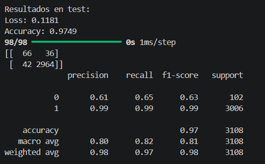
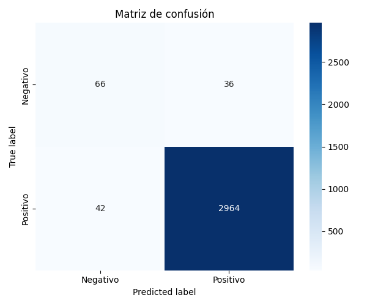

# Clasificación de reseñas de recetas mediante aprendizaje profundo

## Abstract
Este proyecto presenta un modelo de clasificación binaria de texto para identificar si una reseña de receta es positiva o negativa a partir de su contenido textual. Se trabajó con el dataset Recipe Reviews and User Feedback, a partir del cual se construyó una etiqueta binaria usando la calificación en estrellas: reseñas de 1 y 2 estrellas como negativas, y reseñas de 4 y 5 estrellas como positivas. Las reseñas con 0 y 3 estrellas fueron excluidas por considerarse no informativas o ambiguas.

El principal reto del problema fue el fuerte desbalance de clases, ya que la mayoría de las reseñas son positivas. Por ello, además del modelo base, se probaron distintas estrategias de refinamiento como ajuste de hiperparámetros, class_weight, oversampling y data augmentation textual. El modelo fue implementado en TensorFlow/Keras con una arquitectura sencilla compuesta por una capa Embedding, una capa GlobalAveragePooling1D, una capa densa con activación ReLU y una capa de salida sigmoide. Esta arquitectura está alineada con enfoques de clasificación de texto basados en Keras reportados en la literatura.

Los resultados muestran que, aunque la accuracy global es alta, esta métrica por sí sola no describe adecuadamente el desempeño real debido al desbalance del dataset. Por ello, se dio mayor importancia a métricas como precision, recall, F1-score y macro average, especialmente para la clase minoritaria. La mejor versión del modelo alcanzó una accuracy de 0.9749 y un F1-score de 0.63 para la clase negativa, mostrando una mejora respecto a configuraciones previas y un mejor equilibrio entre ambas clases.

## Introducción
La clasificación automática de texto es una de las tareas más importantes dentro del procesamiento de lenguaje natural. Permite organizar grandes volúmenes de información, detectar patrones de opinión y apoyar procesos de análisis automático en contextos reales. En particular, la clasificación de reseñas resulta útil para resumir la percepción de usuarios sobre productos, servicios o contenido digital. La literatura reciente sobre clasificación de texto destaca la utilidad de arquitecturas simples basadas en embeddings y redes neuronales densas cuando se busca una solución ligera y funcional para tareas binarias.

En este proyecto se aborda el problema de clasificar reseñas de recetas como positivas o negativas. Aunque el problema parece sencillo, presenta una dificultad importante: la distribución de clases está fuertemente sesgada hacia la clase positiva. Esto hace que métricas como la accuracy puedan resultar engañosas, ya que un modelo puede obtener un valor alto aun clasificando mal la clase minoritaria. Por esta razón, además de construir el modelo, se evaluó cuidadosamente su comportamiento mediante métricas más adecuadas para datos desbalanceados, como precision, recall y F1-score. Esta decisión también es consistente con los lineamientos del curso, que piden seleccionar métricas acordes al problema y reportar resultados honestos a partir de una correcta separación entre entrenamiento y prueba.

## Objetivo
Desarrollar un modelo de clasificación binaria de texto capaz de identificar si una reseña de receta es positiva o negativa a partir de su contenido textual.

## Dataset seleccionado
Se utilizó el dataset Recipe Reviews and User Feedback, el cual contiene comentarios textuales de usuarios sobre recetas, junto con información adicional como número de estrellas, votos y reputación del usuario. En este proyecto se utilizaron únicamente las columnas:

text: comentario textual del usuario
stars: calificación otorgada por el usuario

Este dataset fue elegido porque:

permite formular un problema de clasificación supervisada
contiene una cantidad adecuada de instancias
requiere una etapa real de limpieza y preparación de datos
presenta un caso realista de desbalance de clases

## Planteamiento del problema
A partir del contenido textual de cada reseña, se construyó una etiqueta binaria:

1 y 2 estrellas → reseña negativa (0)
4 y 5 estrellas → reseña positiva (1)

No se consideraron las reseñas con:

0 estrellas, por ser no informativas
3 estrellas, por representar opiniones neutras o ambiguas

Esta decisión buscó reducir la ambigüedad en el conjunto de datos y facilitar una separación más clara entre ambas clases, como ya habías planteado en tu README original.

## Preprocesamiento realizado
El preprocesamiento consistió en las siguientes etapas:

1. Selección de columnas relevantes. Se conservaron únicamente text y stars.
2. Eliminación de valores nulos. Se descartaron registros con texto vacío o sin calificación válida.
3. Filtrado de clases. Se eliminaron las reseñas con stars = 0 y stars = 3.
4. Construcción de la variable objetivo. Se generó la columna label:
   - 0 = negativo
   - 1 = positivo
5. Limpieza básica del texto. Se aplicaron transformaciones como:
   - conversión a minúsculas
   - corrección de entidades HTML
   - normalización de espacios en blanco
6. Eliminación de duplicados. Se eliminaron registros repetidos para reducir ruido.
7. Separación de datos. El dataset limpio se dividió en:
   - 80% entrenamiento
   - 20% prueba

## Desvalance de clases
Uno de los principales retos del proyecto fue el fuerte desbalance entre clases. Aproximadamente:

96.72% de las instancias corresponden a reseñas positivas
3.28% corresponden a reseñas negativas

Este comportamiento hacía insuficiente evaluar el modelo únicamente con accuracy, ya que un clasificador sesgado hacia la clase mayoritaria podía aparentar un buen desempeño global sin detectar adecuadamente las reseñas negativas. Tal como indica la literatura sobre augmentación y regularización en NLP, este tipo de escenarios requiere estrategias adicionales para mejorar la generalización y reducir sesgos hacia la clase dominante.

## Representación numérica del texto
Para entrenar el modelo, el texto se transformó a representación numérica en tres pasos:

1. tokenización del texto
2. conversión a secuencias numéricas
3. padding para igualar la longitud de las secuencias

Después se utilizó una capa Embedding, la cual aprende representaciones densas de las palabras durante el entrenamiento. Esto permite que el modelo trabaje con una representación semántica más útil que una codificación discreta simple.

## Modelo implementado
Se implementó un modelo de clasificación binaria en TensorFlow/Keras con una arquitectura secuencial compuesta por:

- capa Embedding
- capa GlobalAveragePooling1D
- capa Dense con activación ReLU
- capa de salida Dense(1) con activación sigmoide

La función de pérdida utilizada fue binary_crossentropy y el optimizador fue adam.

Esta arquitectura fue elegida por su simplicidad, bajo costo computacional y buen desempeño reportado en clasificación de texto. De acuerdo con el paper de referencia, la capa Embedding permite aprender representaciones densas de palabras, GlobalAveragePooling1D reduce la dimensionalidad del texto resumiento la secuencia, la capa densa con ReLU aprende patrones no lineales y la salida sigmoide produce una probabilidad para la clasificación binaria.

## Manejo del desbalance
Debido al desbalance del dataset, se exploraron varias estrategias para mejorar el desempeño sobre la clase minoritaria:

### 1. Ajuste de hiperparámetros
Primero se probaron distintas configuraciones de:
- número de épocas
- dimensión del embedding
- tamaño de la capa densa

La configuración base fue:
- epochs = 5
- embedding_dim = 16
- dense = 24

Posteriormente se observó que una configuración más estable era:
- epochs = 15
- embedding_dim = 24
- dense = 24

### 2. Uso de class_weight

Se utilizó class_weight de scikit-learn para asignar mayor peso a la clase minoritaria durante el entrenamiento. Esto permitió penalizar más los errores cometidos sobre las reseñas negativas.

### 3. Oversampling

También se aplicó oversampling sobre la clase minoritaria para incrementar su presencia en el conjunto de entrenamiento y ayudar al modelo a aprender mejor sus patrones.

### 4. Data augmentation textual

Finalmente se incorporó data augmentation textual para generar ejemplos sintéticos adicionales de la clase minoritaria. La literatura describe la data augmentation como una estrategia para construir datos sintéticos a partir del conjunto disponible, ayudando a reducir overfitting, fortalecer la generalización y enfrentar problemas como class imbalance.

En este proyecto, la combinación de oversampling + class_weight + data augmentation produjo la mejor versión del modelo.

## Resultados
### Versión base
Con la configuración:
- epochs = 5
- embedding_dim = 16
- dense = 24

Resultados representativos de una versión inicial del modelo:
- Accuracy: 0.96
- F1-score clase 0: 0.54
- Macro average F1: 0.76

### Configuración refinada
Con la configuración:
- epochs = 15
- embedding_dim = 24
- dense = 24

Se obtuvieron resultados representativos de:
- Accuracy: 0.9681
- F1-score clase 0: 0.58
- Macro average F1: 0.78

### Mejor modelo actual
Con la combinación de oversampling + class_weight + data augmentation, el mejor resultado reportado fue:

  
   
  <em>Figura 1. Métricas de evaluación del mejor modelo en el conjunto de prueba.</em>

Matriz de confusión SVM:

  
   
  <em>Figura 2. Matriz de confusión SVM del mejor modelo de clasificación de reseñas de recetas.</em>

## Interpretación de resultados
Los resultados muestran que el modelo clasifica muy bien la clase positiva, pero el verdadero reto sigue siendo la clase negativa, ya que cuenta con mucho menos ejemplos. Por esta razón, la accuracy no se tomó como único criterio de selección. En su lugar, se dio mayor importancia al comportamiento de la clase 0 mediante precision, recall y F1-score, así como al macro average, que da un panorama más equilibrado del desempeño.

La mejor versión del modelo logró elevar el F1-score de la clase negativa hasta 0.63, lo cual representa una mejora respecto a configuraciones anteriores. Aunque todavía existe espacio de mejora, el modelo ya presenta un comportamiento más equilibrado y útil que una solución que solo optimiza accuracy. Esta decisión también está justificada por los lineamientos del curso, que piden elegir métricas acordes al problema y reportar resultados de forma interpretada, no solo numérica.

## Conclusiones
Se desarrolló un modelo de clasificación binaria para reseñas de recetas utilizando TensorFlow/Keras. El principal reto fue el fuerte desbalance de clases, lo que hizo necesario ir más allá de una evaluación basada solo en accuracy. A través de varias etapas de refinamiento, incluyendo ajuste de hiperparámetros, class_weight, oversampling y data augmentation textual, se consiguió mejorar el desempeño sobre la clase minoritaria.

La mejor versión del modelo alcanzó una accuracy alta y, más importante aún, un mejor equilibrio entre clases, con un F1-score de 0.63 para la clase negativa. Esto muestra que incluso una arquitectura sencilla puede producir resultados útiles si se acompaña de un buen preprocesamiento, una evaluación adecuada y técnicas específicas para enfrentar el desbalance.

## Referencias
- Jiang, X. (2025). Exploring the Impact of Key Factors on the Accuracy of a Keras Machine Learning Model for Text Classification. In Proceedings of the 1st International Conference on Modern Logistics and Supply Chain Management (MLSCM 2024) (pp. 368–371). DOI: 10.5220/0013331400004558.
- Shorten, C., Khoshgoftaar, T. M., & Furht, B. (2021). Text Data Augmentation for Deep Learning. Journal of Big Data, 8, 101. https://doi.org/10.1186/s40537-021-00492-0
- Bhowmik, N. R., Arifuzzaman, M., & Mondal, M. R. H. (2022). Sentiment analysis on Bangla text using extended lexicon dictionary and deep learning algorithms. Array, 13, 100123. https://doi.org/10.1016/j.array.2021.100123
- Valdés Aguirre, B. (s. f.). Módulo 2 - Inteligencia Artificial TC3002B. Google Docs. https://docs.google.com/document/d/1ERemFngFGI1c8jkfclAn1xF4qXQZTpoKlBF07i0EsG0/edit?tab=t.0
